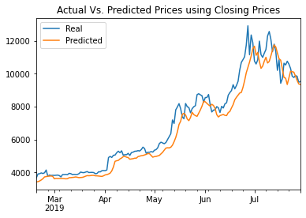

# LSTM Stock Predictor

Due to the volatility of cryptocurrency speculation, investors will often try to incorporate sentiment from social media and news articles to help guide their trading strategies. One such indicator is the [Crypto Fear and Greed Index (FNG)](https://alternative.me/crypto/fear-and-greed-index/) which attempts to use a variety of data sources to produce a daily FNG value for cryptocurrency. You have been asked to help build and evaluate deep learning models using both the FNG values and simple closing prices to determine if the FNG indicator provides a better signal for cryptocurrencies than the normal closing price data.

In this assignment, I use deep learning recurrent neural networks to model bitcoin closing prices. One model uses the FNG indicators to predict the closing price while the second model uses a window of closing prices to predict the nth closing price.

## Final Output

 

> Which model has a lower loss?
* The Model using the Closing Prices data to predict prices has a the lower loss.

> Which model tracks the actual values better over time?
* The Model that predicts the nth price using the Closing Price data has better accuracy.

> Which window size works best for the model?
* A window size of 4 works best for both the FNG and Closing Prices Model.
> 
- - -

© 2019 Trilogy Education Services, a 2U, Inc. brand. All Rights Reserved.
